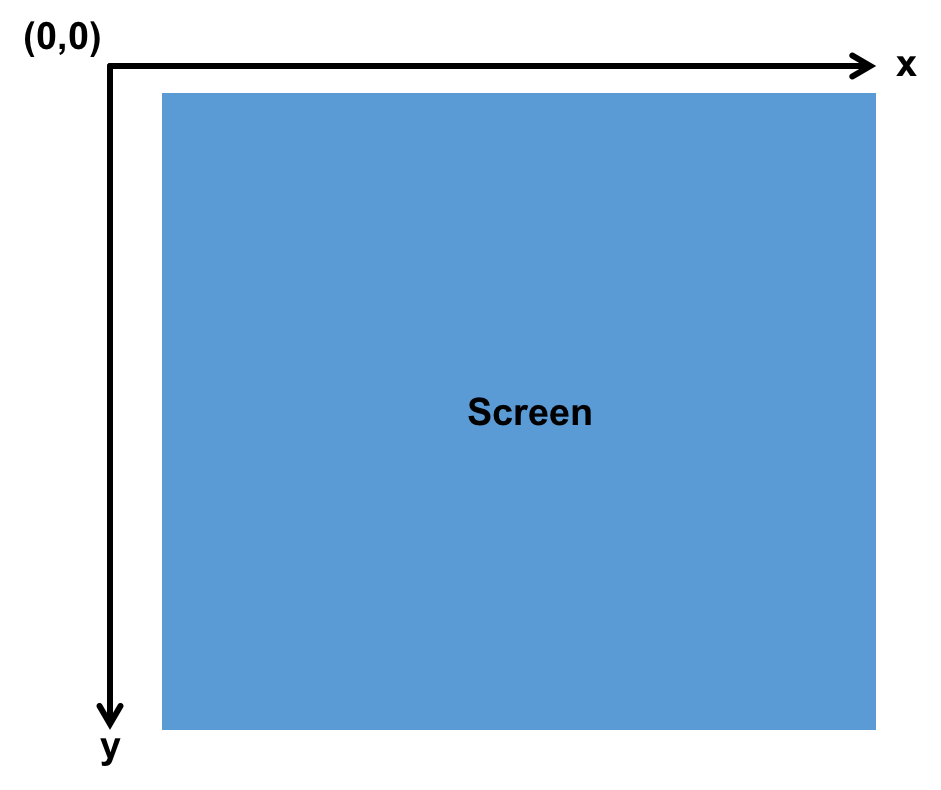
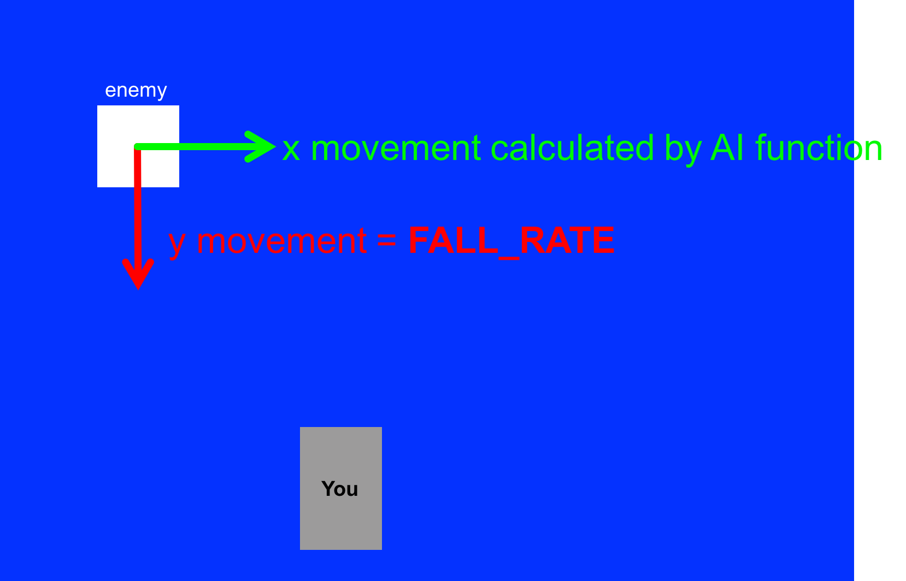
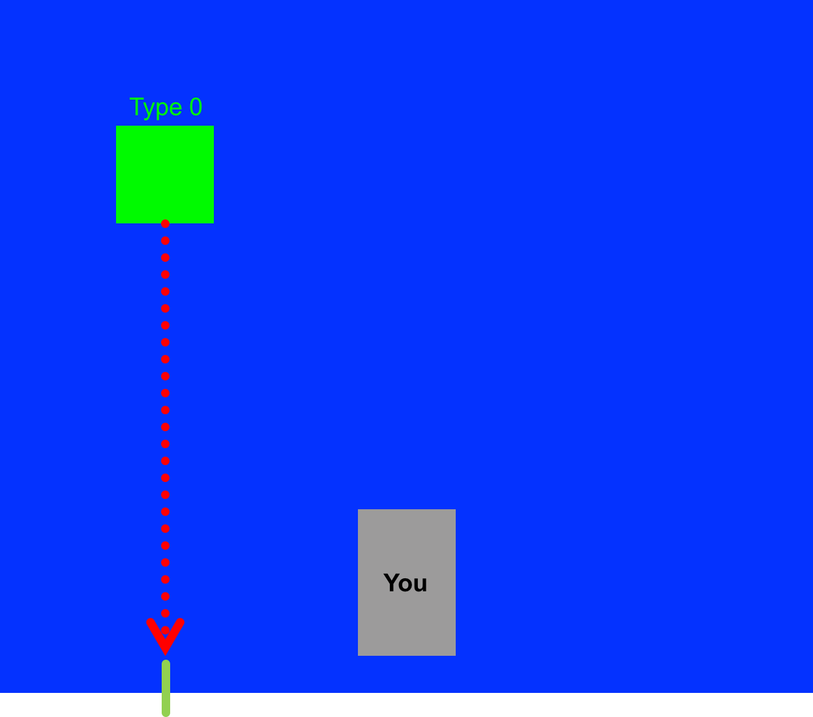
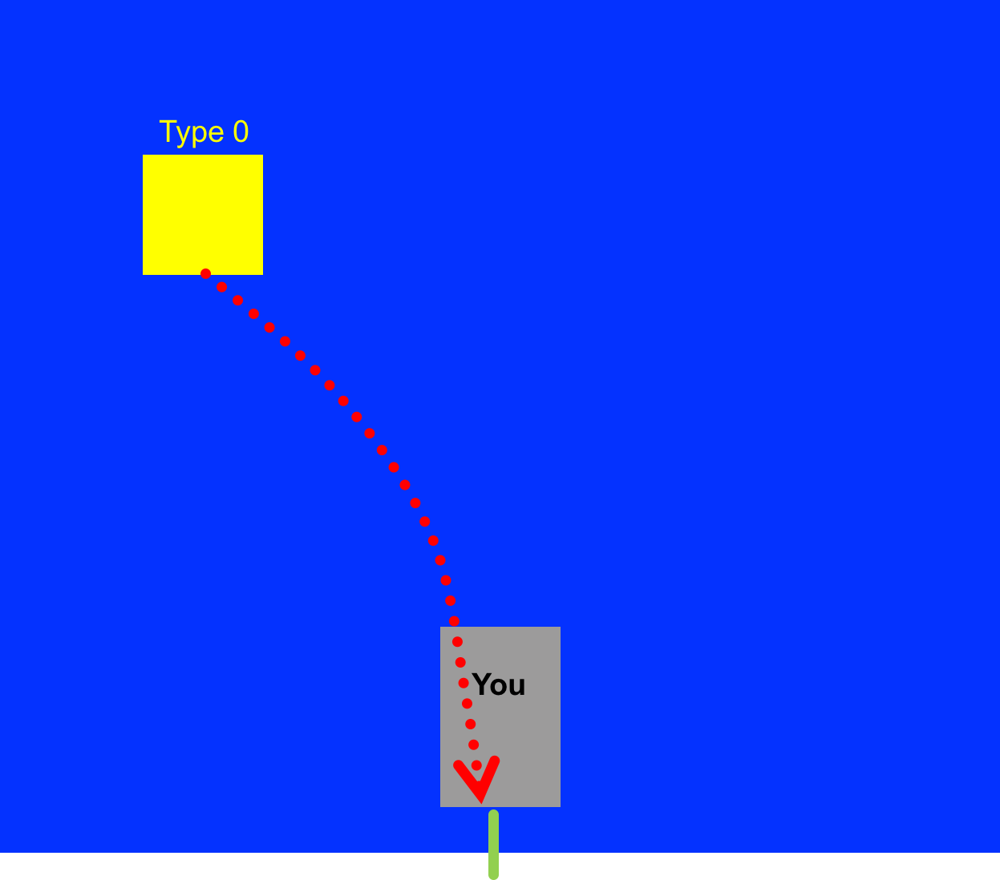
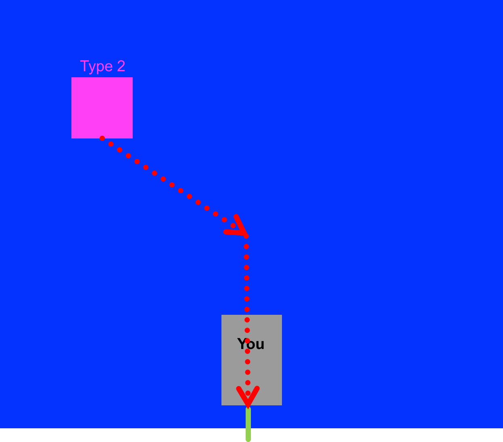
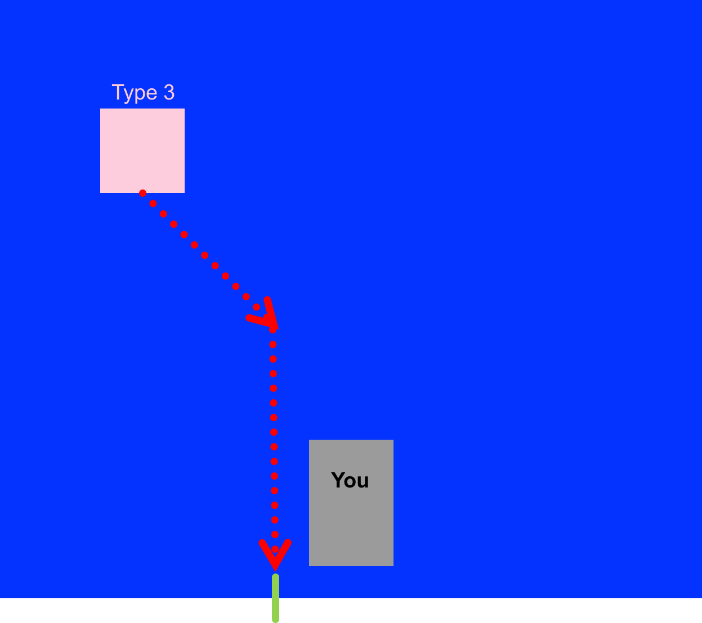
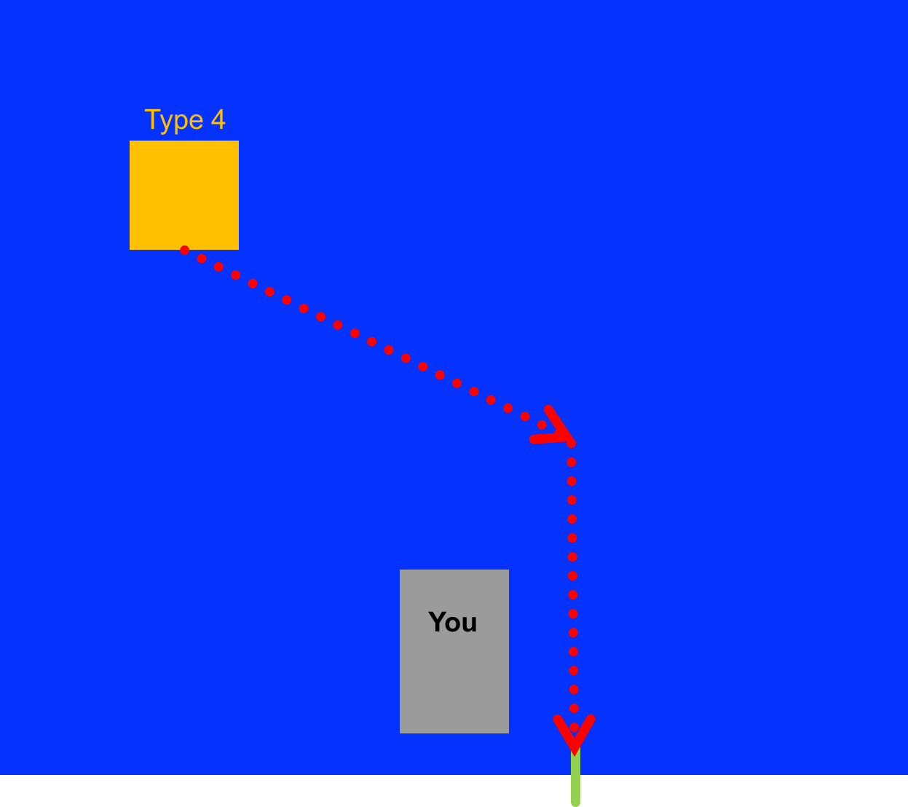
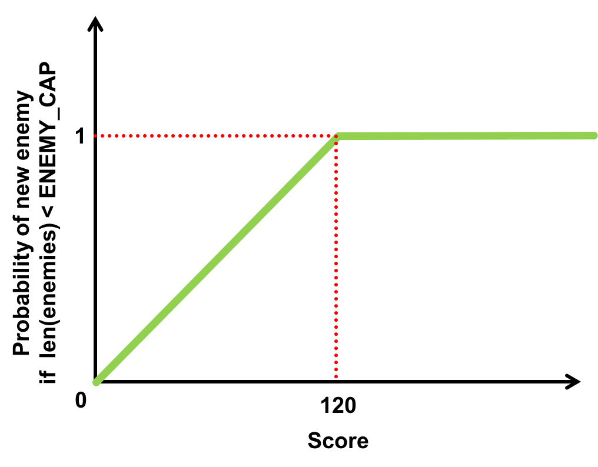

# python_game
Simple Pygame-based game for MITES/MOSTEC EECS Courses

<b>Goals:</b> In today's lab we're going to study and then finish a video game. You will implement the Artificial Intelligence as well as a few other aspects.


Artificial Intelligence (or AI) is a very broad field of EECS research concerned with recreating aspects of what we as humans term intelligence.  While "True" AI usually implies human-level or above learning/reasoning capabilities, it can also be thought of as a sliding scale of capabilities, and really any algorithm which makes intelligent decisions based off of inputs and states and other information is a form of AI.  

A classic place where you'll often encounter AI is in games. "Game AI" is often meant as a separate field from true AI, but the goal is sorta the same. Using programs, create intelligent action (or actions that seem intelligent).  Modern games can have some pretty crazy AI, but an interesting thing about AI is that even relatively simple rules and laws impleented in code can create valid AI.

Check out this neat article on the game artificial AI behind the classic game PACMAN:

<a href="http://gameinternals.com/post/2072558330/understanding-pac-man-ghost-behavior" target="_blank">AI in Pacman</a>

One takeaway from that article is that relatively simple rules that the PacMan Ghosts follow can, in cominbation lead to some really complex emergent behaviors. 

## Game File

Download the <a href="resources/lab09.py.zip">lab09.py.zip</a> file, extract it via the File Manager, and open it up. Run this code. When you do that you should see a small blue window pop up and some instructions.  Play the game. It is neat, but you should notice it is pretty boring. 

Let's review how this game is working.  Look through the file. The `main` function is what is always running. That function in turn calls other functions such as `startScreen`, `instructionsScreen`, `gameRun`, and `endScreen`.  These functions run different aspects of the "game experience".  These functions also call other functions. And many of these functions call even more functions.  There are about four to five layers of abstraction in this game file from highest level function to lowest level function.  

`startScreen`, `instructionsScreen`, and `endScreen` are all simple one-page functions that generate an image with text/colors (go ahead and change them as you like!) The bulk of the actual game proper takes place inside of the `gameRun` function. Discuss with staff and eachother how that function works.

The game (and most games) work on a process-render-process-render-etc... cycle where processing involves calculating all the game's math including the new object positions, creation of new objects, collission detection, object removal (from collision or flying off screen), etc...The "render" step involves drawing all of this.  The game you have in front of you tries to accomplish this loop 30 times per second. In so doing, it gives (from human perspective) continuous movement/responsiveness. The global variable `FPS` sets the speed. Trying to go too fast or do too many calculations per step can of course cause the system to operate suboptimally so picking this number is about tradeoffs.  

## Rendering
All graphics in this game are "drawn" on the screen using Pygame library methods.  In almost all computer graphics situations your screen has the following orientation with the origin in the upper left corner, y increasing as you go downwards, and x increasing as you go rightwards.  Generally there are no negative coordinates on a screen nor are there coordinates beyond the height and width of as screen.
<center>

</center>

## Elements

The primary actors in this game are you (the main character controllable by the player), food, and the enemies, and missiles.  The enemies, food, missiles, and yourself are all built around what we term a **prototype**...this is a blueprint describing how each of these things should work/look/act.  When running, the game may have multiple **instances** of each prototype (we say "may" because you, the character, will only have one instance). We contain information about the multiple instances in three lists in this game:

* `enemies` contains a list of the relevant information of all enemies.  Each instance of an enemy is represented by a three-long list: `[x_pos, y_pos, type]`, where the first two terms specify the particular enemy instance's position in the game screen and the third term specifies the "type" of enemy (used to dictate its actions via AI function and its color)
* `missiles` contains a list of the missile instances.  Each instance is a two-long list containing the x and y position of the particular missile
* `foods`: contains a list of the food instances. Each food instance is a two-long list containing the x and y position of the particular food

These lists will grow and shrink over the span of the game as these instances collide/hit you/are eaten/appear and dissapear off screen, etc...

The instance of you the character is contained within the set of variables defined at the top:

```
###important variables for player/character run time
#starting character position:
char_posx = SCREENWIDTH/2
char_posy = SCREENHEIGHT-30
#how many missiles you've got left:
#score:
missile_stock = 10
score = 0
#lives:
lives =3
```

These parameters specify where you are at any given step in the game, what your score is, what your missile count is, how many lives you have.

Every step through the game all the values in these different element instances updates either based on automatic calculations (y movement is constant for most things), AI input (which you'll be writing) or user input (your inputs to control the grey box).

## Artificial Intelligence

The first thing you'll notice with this game is that it should be pretty easy. The enemies are stupid and not challenging. 


```
    for enemy in enemies:
        newx = AI(char_posx,enemy[0],enemy[2])
        candidate = [newx,enemy[1]+FALL_RATE,enemy[2]]
```

<center>

</center>

Currently all the enemies are "type 0" which have a dumb AI. They simply move straight down and do not use your location (the `charx` variable) to make any decisions. We want t change that.

<center>

</center>

### Type 1
The first new type we'll create will proportionally track you.  That is its new position should be based on the following equation where $\Delta x$ is the amount to move on the next time step:
$$
\Delta x = 0.01\cdot\left(x_{char} - x_{enemy}\right)
$$
This should result in a tracking behavior similar to the image below:
<center>

</center>

### Type 2
Type 2 will go directly at you at a constant rate. Its new position should be based on the following equation  where $\Delta x$ is the amount to move on the next time step:
$$
\Delta x = \begin{cases}
-1~\text{if } x_{char} - x_{enemy}<0\\
+1~\text{if } x_{char} - x_{enemy}>0\\
0 ~\text{if } x_{char} = x_{enemy}
\end{cases}
$$
This should result in a tracking behavior similar to the image below where it aims for you the character and then goes straight down when lined up.
<center>

</center>

### Type 3

Type 3 should be just like Type 2 but it should aim for 10 pixels to the left of you. This should result in a tracking behavior similar to the image below:
<center>

</center>

### Type 4

Type 4 should be just like Type 2 but it should aim for 10 pixels to the right of you. This should result in a tracking behavior similar to the image below:
<center>

</center>

We want to encapsulate this behavior calculation/determination into the `AI` function.  This function should take in three arguments:

*`charx` The x position of the main character (you)
* `enemyx` The x position of the enemy
* `type` The type of enemy

It should return the **new x position** for that particular enemy! Write this function and test it below. When it is working, add it into your code and try it out!


## Releasing Enemies

Every time through the loop in the `updateEnemiesAndMissiles` function the following line gets run:
```
    if len(new_enemies)< ENEMY_CAP and rand(enemy_release(score)):
        new_enemies.append([randXSpot(),0,randtype()])
```

Part of what makes games fun is that they can get progressively more challenging as you go along. Currently no matter how long you've been playing there is a 0.05 chance on any given time step that a new enemy will be added into the world...this is a rather low probability and the number of enemies never really gets much higher than a few.  What we want is teh probability of new enemies appearing to go up as your score goes up. As a result we want the function `enemy_release` to gradually produce larger numbers as the score goes up and up.  Complete the function `enemy_release` which takes in the game score and based off of that returns a number used by the rest of the code to determine if a new enemy should appear. We want `enemy_release` to behave as shown in the following plot: 

<center>

</center>

Write this function, test it below, and when complete add it into your code.


## Moving On

You can build on this game in pretty much infinite different ways.  Below I added backstory to the game (to give more purpose/motivation) and added music (Since this is all written in pygame and that let's us play music it was pretty easy).

<a href="https://www.youtube.com/watch?v=vLYEkUcolOQ" target="_blank">Working Game</a>

<iframe width="560" height="315" src="https://www.youtube.com/embed/vLYEkUcolOQ" frameborder="0" allowfullscreen></iframe>

To complete the lab, add one additional feature to the game.  Some ideas include:

* Gain a life every $n$ points scored
* Create even more intelligent/hard-to-beat enemies (Better AI)
* Create AI that take multiple missiles to kill
* Add music
* Add different types of food (make food start having a type)


